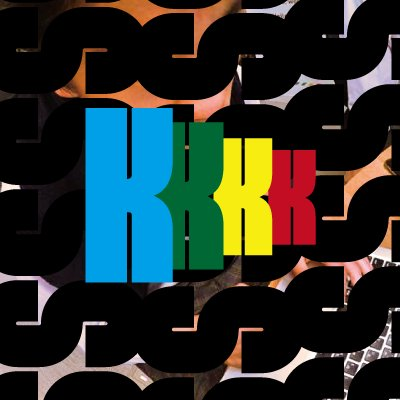

# Kotaro Suto's Portfolio

## I am ...

- a college student majoring Computer Science
- interested in iOS development, Compiler, and Web backend

## Experiences

 - Participated in Mitou Junior 2017. (2017/5 - 2017/10)
- Internship at AbemaTV iOS team (2019/1 - 2019/7)
- Internship at minimo iOS team, mixi, Inc (2021/8 - 2021/9)
- Internship at minimo iOS team, mixi, Inc (2022/8 - 2022/9)

## Education

- Currently pursuing BS in Computer Science at University of California, Santa Cruz
- Graduated from De Anza College

## Projects

- Music Reminder
- [BitcoinPriceChecker](https://github.com/KS1019/BitcoinPriceChecker)
- [CA-Tech-Challenge-ONLINE-ACE](https://github.com/KS1019/CA-Tech-Challenge-ONLINE-ACE)
- [Hondana](https://github.com/KS1019/Hondana)
- [Script.swift](https://github.com/KS1019/Script.swift)
- [SwiftyShell](https://github.com/KS1019/SwiftyShell)
- [SwiftyRobPikeRegex](https://github.com/KS1019/SwiftyRobPikeRegex)

## Contacts

- [GitHub](https://github.com/KS1019)
- [LinkedIn](https://www.linkedin.com/in/kotarosuto/)